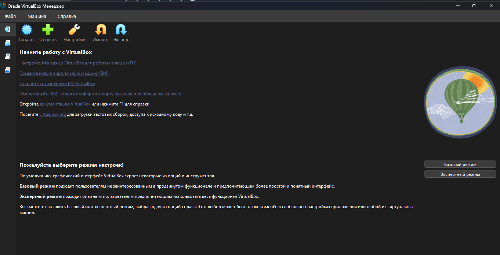
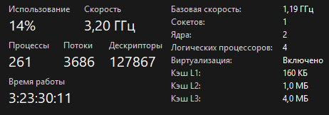
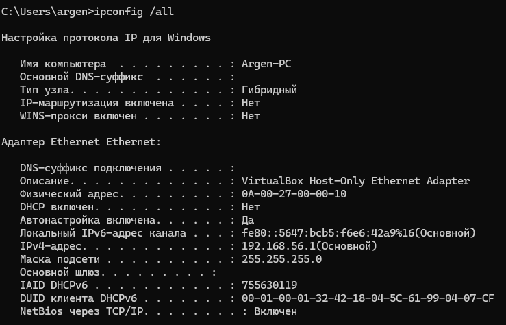
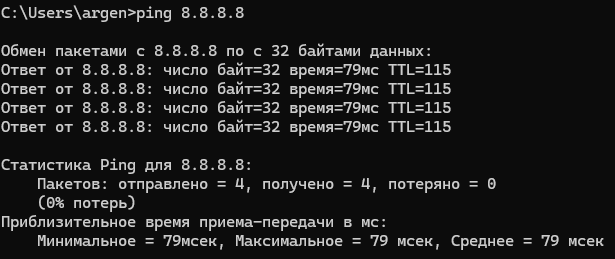
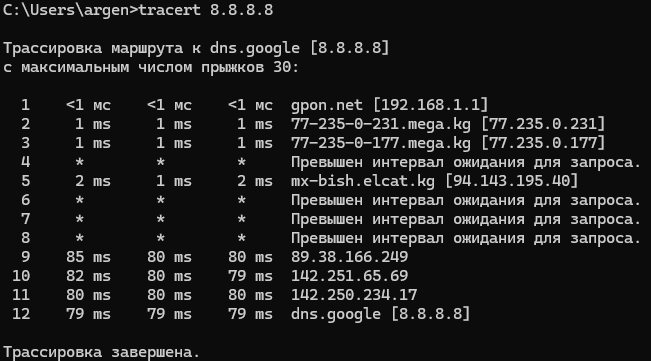
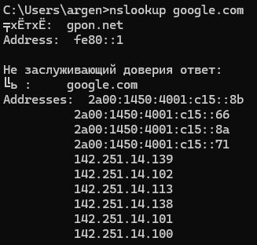
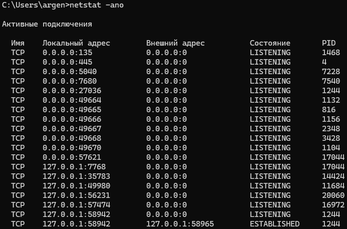
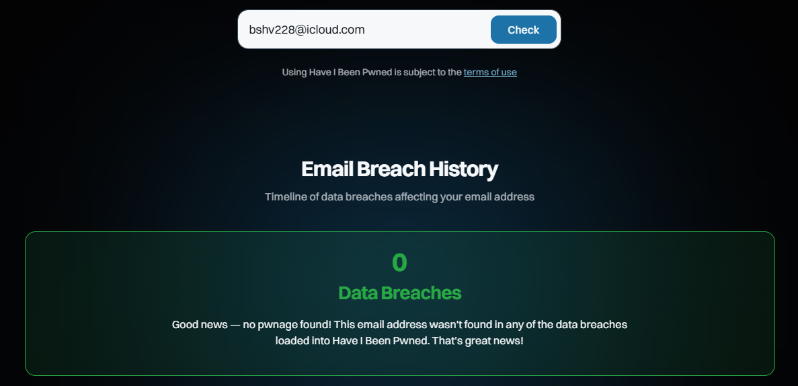

### Домашнее задание №1

Выполнить:
1. Установить VirtualBox
2. Проверить, что в BIOS включена виртуализация
3. Скачать ISO Ubuntu Server
4. Выполнить в cmd:
> ipconfig /all \
> ping 8.8.8.8 \
> tracert 8.8.8.8 \
> nslookup google.com \
> netstat -ano

Скрины + своими словами: что показала каждая команда.

5. Проверить свою почту на haveibeenpwned.com
___
##### Установка VirtualBox

___
##### Проверка виртуализации

___
##### Установка ISO Ubuntu Server

___
##### Выполнение команд
>ipconfig /all

 \
Команда показывает всю информацию сетевых параметров (айпи адрес, мак адрес, маску и тд)
___
> ping 8.8.8.8

 \
Команда проверяет стабильность интернет соединения
___
> tracert 8.8.8.8

 \
Команда показывает путь интернет сигнала от компьютера до Google
___
> nslookup google.com

 \
Команда, которая выводит IP-адрес сайта
___
> netstat -ano

 \
Команда, которая показывает полный список всех интернет-соединений открытые на компьютере прямо сейчас.
___

##### Проверка почты на haveibeenpwned.com

