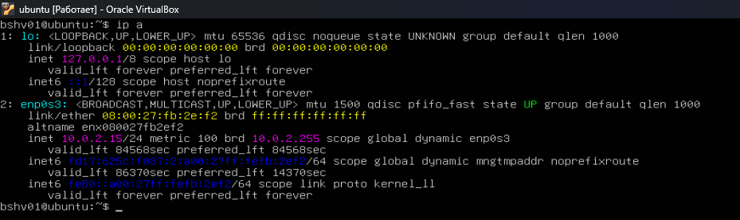
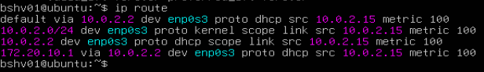
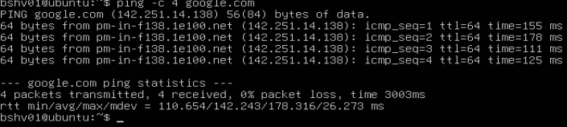
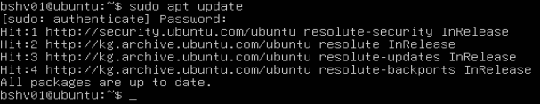

### Домашнее задание №2
___
Выполнить на сервере: \
ip a \
ip route \
ping -c 4 google.com \
sudo apt update \

Придумайте по одному нарушению C, I и A — из жизни или новостей, не из урока.

___
> ip a

___
>ip route

___
>ping -c 4 google.com

___
>sudo apt update 

___
Пример CIA: \
C - Утечка баз данных клиентов банка. \
I - Подмена реквизитов в счете. \
A - DDoS-атака на сайт авиакомпании. 