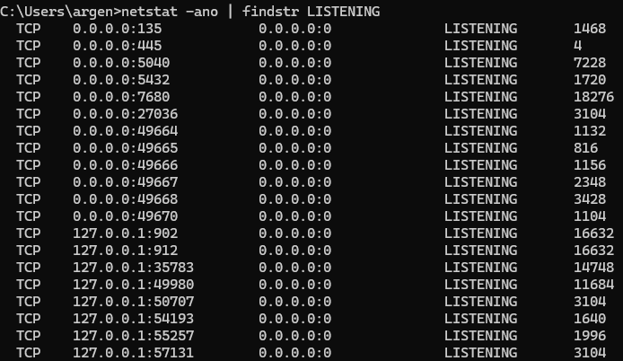
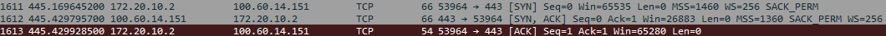

### Домашнее задание №3
___
1. Скрин команды со слайда 3 и таблица из 3–5 строк: \
порт · программа · 0.0.0.0 или 127.0.0.1 · нужна ли
2. Скрин из Wireshark: три пакета соединения с любым сайтом. Подпишите, где SYN, SYN-ACK и ACK.
3. По 2–3 предложения: \
Чем TCP отличается от UDP? Пример из жизни для каждого. \
Зачем нужны порты? \
Почему открытый в интернет RDP опасен?

___
>netstat -ano | findstr LISTENING

___

> Скрин из WireShark

Три пакета соединения с сайтом online.geeks.kg \
Первая строка - SYN \
Вторая строка - SYN-ACK \
Третья строка - ACK
___
> Чем TCP отличается от UDP?

TCP - гарантирует доставку пакетов в целостности, но с меньшей скоростью. \
UDP - доставляет пакеты на высокой скорости, но без гарантия целостности.
___
> Зачем нужны порты?

Для того, чтобы определять, какая именно программа/сервис/служба должна получать данные
___
> Почему открытый в интернет RDP опасен?

Потому что подклюиться может кто угодно.